Of course. This is a powerful concept that deserves clear visualization. The "artifact-passing" between short, focused AI conversations is a key pattern for ensuring reliability and control.

Here is a document with Mermaid diagrams illustrating the sequential and branching flows of your AI workflow rules, with a specific focus on this conversational model.

***

# Visualizing the AI Development Workflow: An Artifact-Driven Approach

## The Core Concept: Artifact-Passing Between Conversations

The rules in this repository are designed to work within a specific conversational model. Instead of having one long, continuous conversation with the AI, the workflow is broken down into a series of short, focused interactions.

Each interaction:
1.  Takes a specific input (user prompt or a file).
2.  Invokes a targeted set of rules.
3.  Produces a tangible **artifact** (e.g., a markdown file, a YAML file, a set of commits).

This artifact then becomes the explicit, version-controlled input for the *next* conversation. This methodology keeps conversations short, reduces the risk of the AI losing context, and creates a clear, auditable trail of progress.

The following diagrams illustrate how these rules connect within this artifact-passing framework.

---

### Playbook 1: Project Inception & Documentation Generation

This playbook visualizes the workflow for taking a high-level idea and transforming it into a complete set of foundational project documents. Each step creates an artifact that informs the next.

*   **Problem:** A new project needs to be defined, but all that exists is a collection of notes or a high-level idea.
*   **Solution:** A sequential workflow that builds the PRD, Tech Stack, API Spec, and other key documents, ensuring each is based on the last.

```mermaid
%% Diagram showing the sequential creation of project documentation.
%% Each rule consumes an artifact from the previous step.
graph TD
    subgraph "Phase 1: Project Definition"
        A[User provides initial idea, e.g., in NOTES.md] --> B(docs/prd.mdc);
        B --> C[📄 docs/PRD.md Artifact 1\: Requirements];
        C --> D(docs/tech-stack.mdc);
        D --> E[📄 docs/TECH_STACK.md Artifact 2\: Tech Choices];
    end

    subgraph "Phase 2: Technical Specification (Branching Paths)"
        E --> F{What to specify next?};
        F -- API Spec --> G(docs/openapi-spec.mdc);
        G --> H[📄 docs/openapi.yaml Artifact 3a\: API Contract];

        F -- Architecture Diagram --> I(documentation/diagram.mdc);
        I --> J[📄 docs/diagrams/arch.md Artifact 3b\: Visual Plan];
        
        F -- File Structure --> K(workflows/docs/structure.mdc);
        K --> L[📄 docs/STRUCTURE.md Artifact 3c\: Code Layout];
    end

    subgraph "Phase 3: Finalization"
        H --> M{Ready for Development Planning};
        J --> M;
        L --> M;
    end

    %% Styling
    style B fill:#f9f,stroke:#333,stroke-width:2px;
    style D fill:#f9f,stroke:#333,stroke-width:2px;
    style G fill:#f9f,stroke:#333,stroke-width:2px;
    style I fill:#f9f,stroke:#333,stroke-width:2px;
    style K fill:#f9f,stroke:#333,stroke-width:2px;
    style C fill:#ccf,stroke:#333,stroke-width:2px;
    style E fill:#ccf,stroke:#333,stroke-width:2px;
    style H fill:#ccf,stroke:#333,stroke-width:2px;
    style J fill:#ccf,stroke:#333,stroke-width:2px;
    style L fill:#ccf,stroke:#333,stroke-width:2px;
```



---

### Playbook 2: The Core Development Cycle

This is the central workflow for implementing features or fixing bugs. It shows the critical branching point between a formal, GitHub-issue-driven approach and a more lightweight, local-file-driven approach.

*   **Problem:** A developer needs to implement a planned task, but the process can be chaotic and untracked.
*   **Solution:** A structured cycle of planning, execution, and finalization. The "plan" artifact (either a GitHub Issue or a local file) becomes the immutable blueprint for the execution phase.

```mermaid
%% Diagram showing the main development loop, with branching for GitHub vs. Local planning.
graph TD
    subgraph "A. Planning Phase"
        Start[User\: I need to implement Feature X] --> PlanDecision{How to plan?};
        
        PlanDecision -- "Formal Task - (Traceable)" --> PlanGitHub(workflows/github/plan-github.mdc);
        PlanGitHub --> ArtifactGitHub[📄 GitHub Issue with Plan Artifact [Remote]];

        PlanDecision -- "Local Task - (Exploratory)" --> PlanLocal(workflows/task/plan.mdc);
        PlanLocal --> ArtifactLocal[📄 docs/tasks/task-plan.md Artifact [Local]];
    end

    subgraph "B. Execution Phase"
        ArtifactGitHub --> ExecuteGitHub(workflows/github/execute-github.mdc);
        ArtifactLocal --> ExecuteLocal(workflows/task/execute.mdc);

        %% Interruption & Continuation
        InterruptedGitHub[Task Interrupted] -.-> ContinueGitHub(workflows/github/continue-github.mdc);
        ContinueGitHub --> ExecuteGitHub;

        InterruptedLocal[Task Interrupted] -.-> ContinueLocal(workflows/task/continue.mdc);
        ContinueLocal --> ExecuteLocal;

        ExecuteGitHub --> CodeCommitted[✅ Code is Committed];
        ExecuteLocal --> CodeCommitted;
    end

    subgraph "C. Finalization Phase"
        CodeCommitted --> OptionalReview{Optional: Pre-commit review?};
        OptionalReview -- Yes --> Review(workflows/github/review-github.mdc);
        Review --> OptionalReview;
        OptionalReview -- No --> CreatePR(workflows/github/pr-create-github.mdc);
        CreatePR --> PRBody[📄 docs/pr/pr-body.md Artifact\: PR Notes];
        PRBody --> Done[🚀 Pull Request Created];
    end

    %% Styling
    style PlanGitHub fill:#f9f,stroke:#333,stroke-width:2px;
    style PlanLocal fill:#f9f,stroke:#333,stroke-width:2px;
    style ExecuteGitHub fill:#f9f,stroke:#333,stroke-width:2px;
    style ExecuteLocal fill:#f9f,stroke:#333,stroke-width:2px;
    style CreatePR fill:#f9f,stroke:#333,stroke-width:2px;
    style Review fill:#f9f,stroke:#333,stroke-width:2px;
    style ArtifactGitHub fill:#ccf,stroke:#333,stroke-width:2px;
    style ArtifactLocal fill:#ccf,stroke:#333,stroke-width:2px;
    style PRBody fill:#ccf,stroke:#333,stroke-width:2px;
    style Done fill:#cfc,stroke:#333,stroke-width:2px;
```

---

### Playbook 3: Meta-Workflows & System Improvement

This playbook illustrates how the rule system improves itself. It's a feedback loop where the outcomes of conversations (both successes and failures) are used to generate new, permanent rules.

*   **Problem:** Workflows fail, or successful patterns are forgotten. Personal developer environments are not accounted for.
*   **Solution:** A set of meta-rules that analyze conversations to create new rules, codifying lessons learned and capturing user context.

```mermaid
%% Diagram showing how the system learns and adapts.
graph TD
    subgraph "Capturing Lessons from Conversations"
        A[🎉 Successful, Reusable Conversation] --> B(workflows/meta/create-workflow.mdc);
        B --> C[📄 New Workflow Rule Artifact\: Codified Success];
        
        D[💥 Workflow Fails or is Inefficient] --> E(workflows/analysis/document-failures.mdc);
        E --> F[📄 New Prevention Rule Artifact\: Codified Failure];
    end
    
    subgraph "Personalizing the Environment"
        G[User\: This AI is too aggressive] --> H(workflows/config/personalize-rule.mdc);
        H --> I[⚙️ Existing Rule is Locally Overridden [Not an artifact, a state change]];
        
        J[User\: Scan my environment so you know what tools I have] --> K(workflows/config/update-personal-rules.mdc);
        K --> L[📄 .cursor/rules/_/user.mdc Artifact\: Personal Environment Profile];
    end

    subgraph "Informing Future Work"
        C --> M{All Future Conversations};
        F --> M;
        L --> M;
    end

    %% Styling
    style B fill:#f9f,stroke:#333,stroke-width:2px;
    style E fill:#f9f,stroke:#333,stroke-width:2px;
    style H fill:#f9f,stroke:#333,stroke-width:2px;
    style K fill:#f9f,stroke:#333,stroke-width:2px;
    style C fill:#cfc,stroke:#333,stroke-width:2px;
    style F fill:#fcc,stroke:#333,stroke-width:2px;
    style L fill:#ccf,stroke:#333,stroke-width:2px;
```